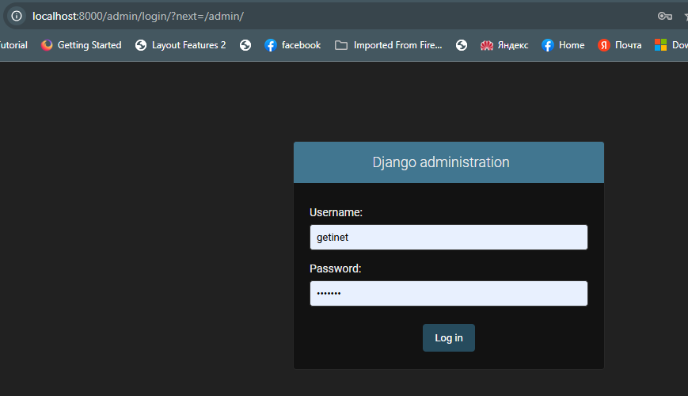
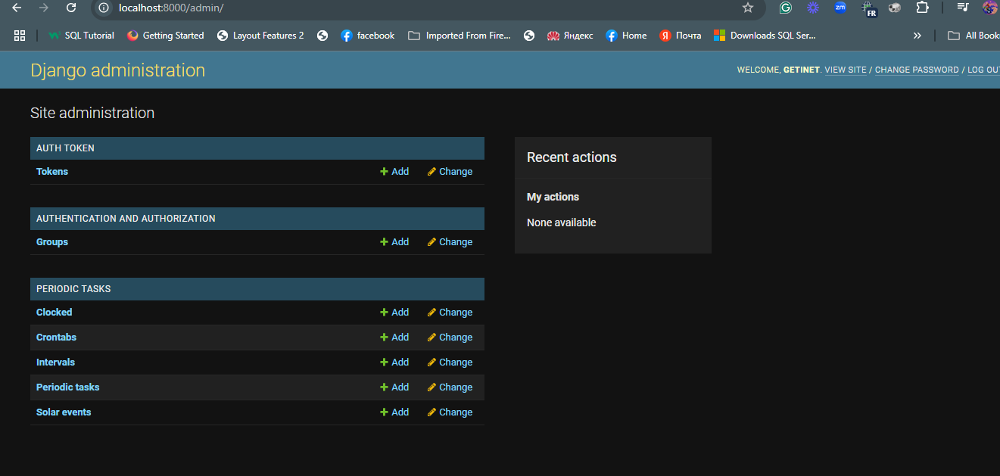
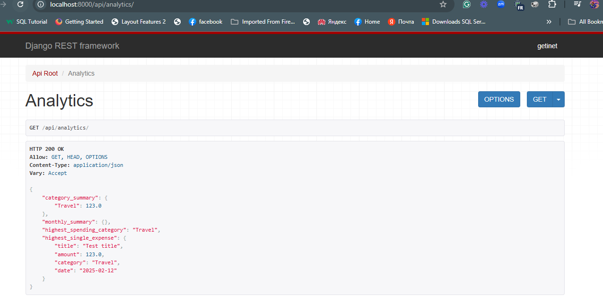
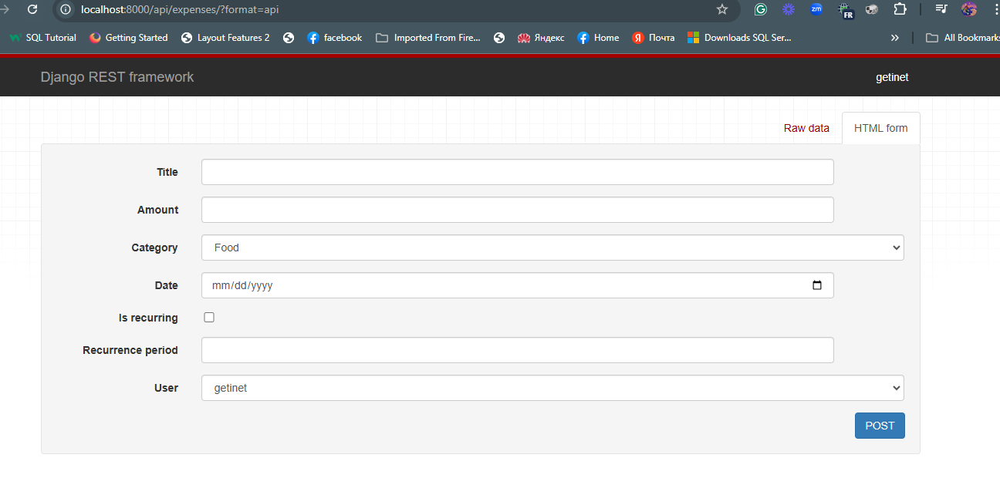
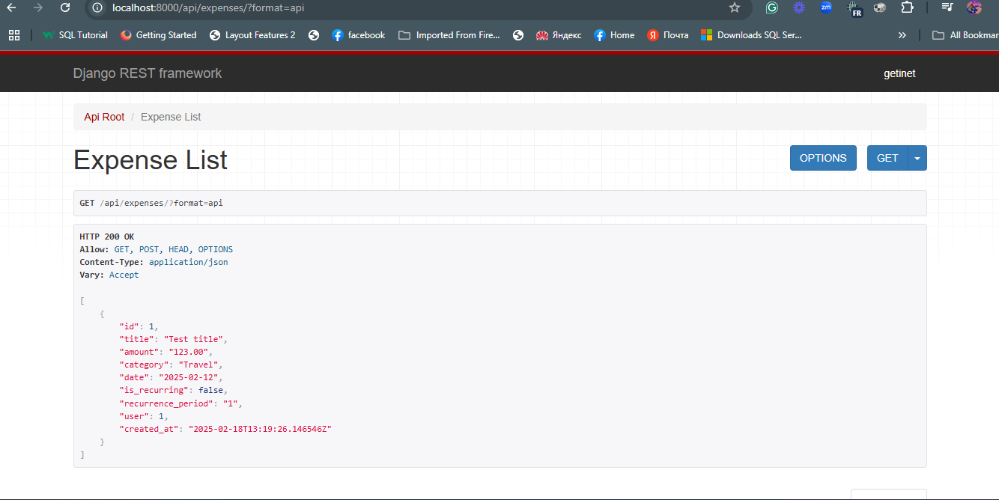
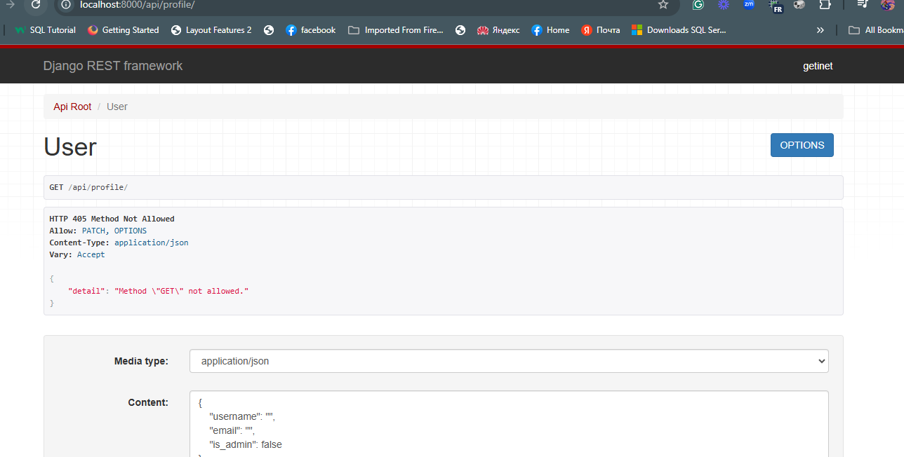
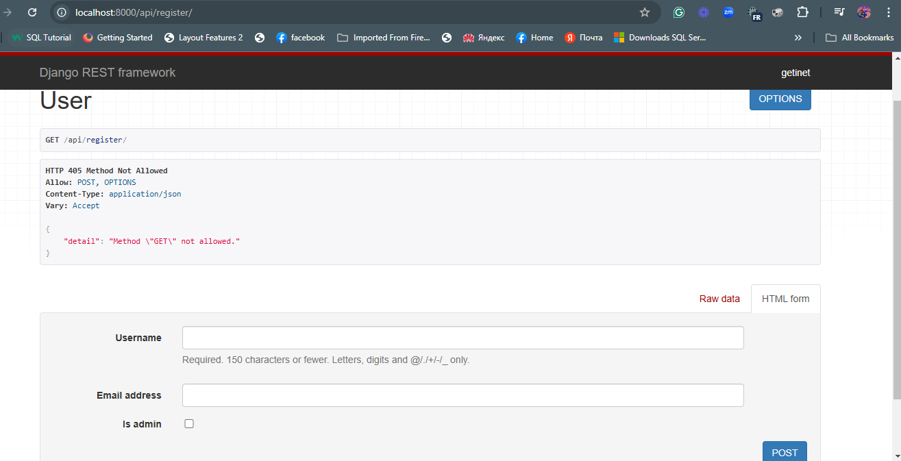

*# ExpenseTracker

ExpenseTracker is a Django-based web application for tracking personal expenses. It allows users to record their expenses, categorize them, and analyze their spending patterns.

## Features

- User registration and authentication
- Record and categorize expenses
- View and update expense records
- Analytics for expense summary and trends
- Recurring expense management
- RESTful API for integration with other services

## Installation

1. Clone the repository:
    ```sh
    git clone https://github.com/gama1221/expensetracker.git
    cd expensetracker
    ```

2. Create a virtual environment and activate it:
    ```sh
    python -m venv venv
    source venv/bin/activate  # On Windows use `venv\Scripts\activate`
    ```

3. Install the dependencies:
    ```sh
    pip install -r requirements.txt
    ```

4. Apply the migrations:
    ```sh
    python manage.py migrate
    ```

5. Create a superuser:
    ```sh
    python manage.py createsuperuser
    ```

6. Start the development server:
    ```sh
    python manage.py runserver
    ```

## Usage

- Access the admin panel at `http://127.0.0.1:8000/admin/` to manage users and expenses.
- Use the API endpoints to interact with the application programmatically.

## API Endpoints

- `POST /api/register/` - Register a new user
- `POST /api/login/` - Login a user
- `PATCH /api/profile/` - Update user profile
- `GET /api/expenses/` - List all expenses
- `POST /api/expenses/` - Create a new expense
- `GET /api/analytics/` - Get expense analytics

## Screenshoots









## Running Tests

To run the tests, use the following command:

```sh
python manage.py test
```
## Apply the migrations:

```sh
python manage.py migrate
```

# Contact
For any inquirie, please contact **getinet.neu@gmail.com**